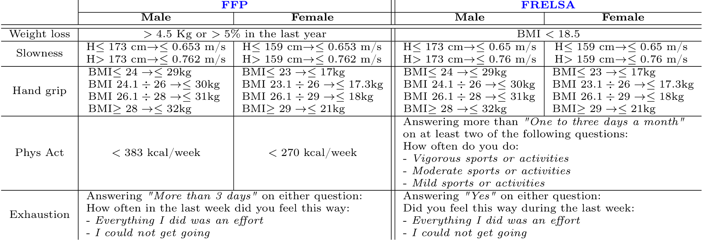

# FRELSA Dataframe

This repository makes reference to the article *FRELSA: A Dataset for Frailty in Elderly People Originated from Elsa and Validated Through Machine Learning Models* (Preprint https://papers.ssrn.com/sol3/papers.cfm?abstract_id=4824047),
and it is intended to create the FRELSA database, and train some simple architectures for frailty detection and prediction scopes.

To properly use this repository you should have access to the data of wave 5 and wave 6 of ELSA, the English Longitudinal Study of Ageing (see portal https://www.elsa-project.ac.uk/).
Starting from wave 6 data, a frailty label is generated, following Fried's Frailty Phenotype definition, just as described in the following image:

Wave 6 data are then used for a detection task, while wave 5 data for a prediction classification problem with a two years horizon.

Run the FRELSA-run Notebook to generate the frailty label, select the best features from both waves using the MultiSURF algorithm (this operation is costly and requires parallel jobs), and train several ML architectures on each wave. 

Alternatively, run main.py to create the frailty label. Run preprocess.py to select best features for detection and prediction. Run models.py to train models and save the results.
